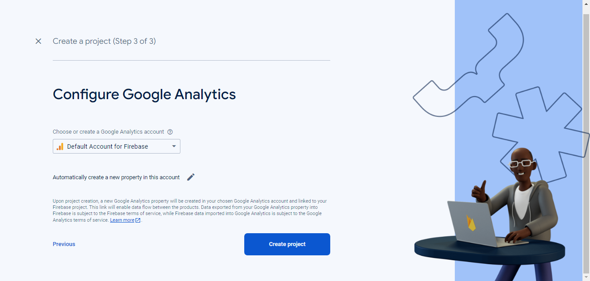
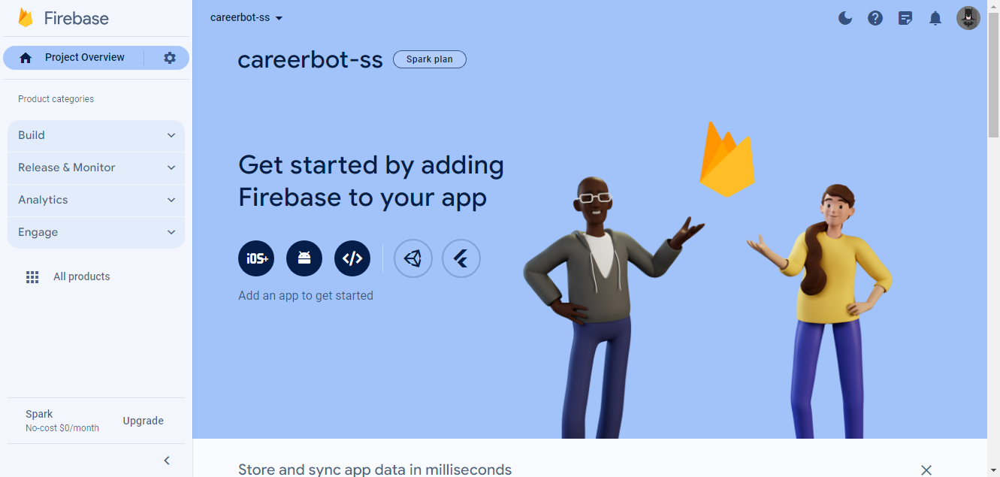
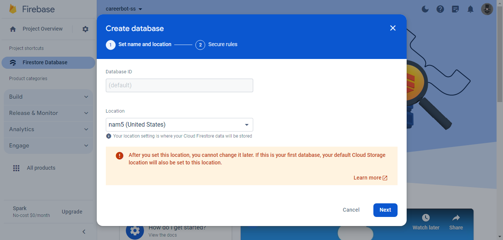
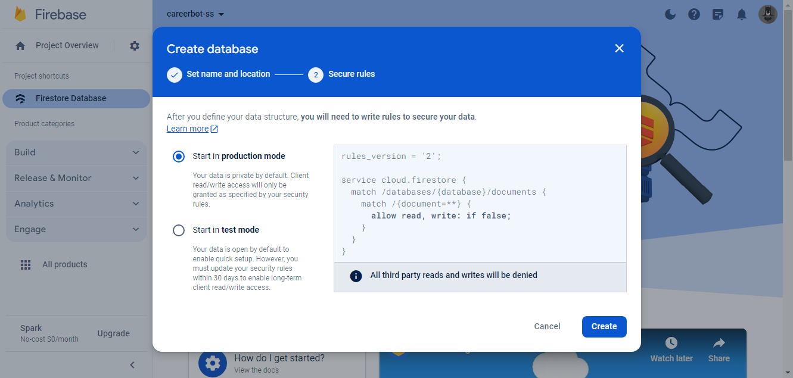
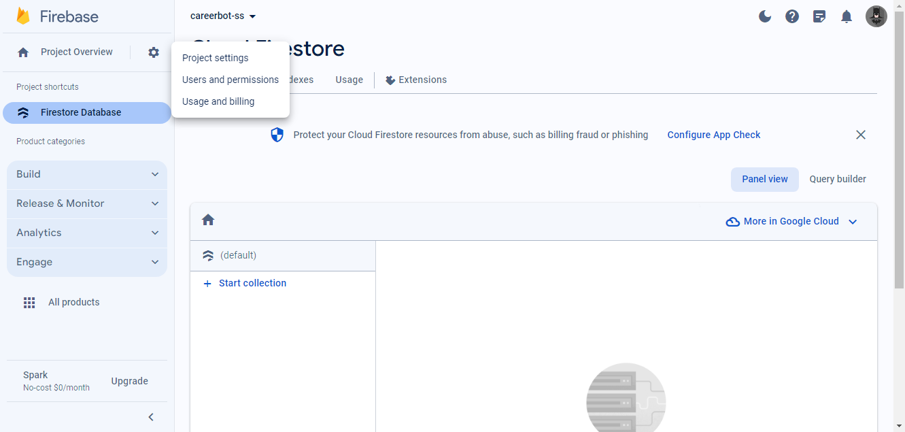
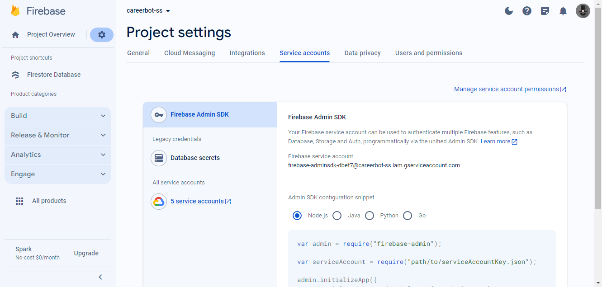
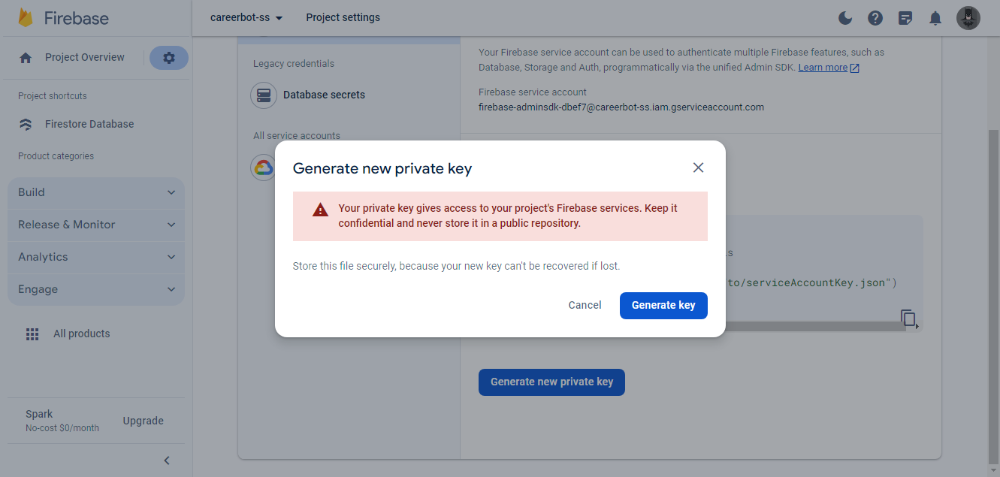
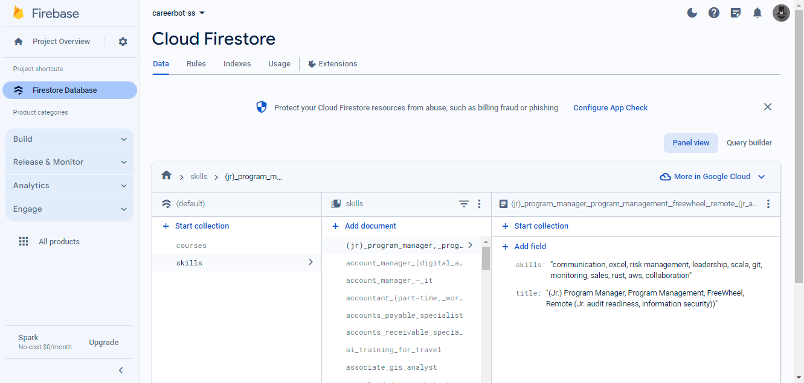

# Firebase Setup and Python Integration


In this guide, we'll walk you through setting up a new Firebase project, obtaining the `serviceAccountKey.json`, installing the Firebase Python SDK, and running a Python script to interact with Firebase.

## Firebase Setup

1. **Create a New Firebase Project:**

   - Go to the [Firebase Console](https://console.firebase.google.com/).

   

   - Click on "Add project" and give a project name, then click on "Continue".

   

   - By default, click on "Continue" to enable analytics.

   

   - By default, click on "Create Project."

   

   - Firebase will allocate resources for our project.

   

   - Once it's completed, click on "Continue" to go to the project.

   

2. **Add Firebase to Your Web App:**

   - After creating the project, click on "Add app" and select the web platform (</> icon) and follow the instructions.

   

3. **Create Firestore Database:**

   - Create a database by setting the location and click next.

   

   - Select "Start in production mode" and click create.

   

4. **Get `serviceAccountKey.json`:**

   - Go to Project Settings in the Firebase Console.

   

   - Navigate to the "Service accounts" tab.

   

   - Scroll down, click on "Generate new private key" to download the `serviceAccountKey.json` file.

   

   - Keep this file secure, as it authenticates your application with Firebase services.

## Python Setup

1. **Clone the Repository:**

   ```
   git clone https://github.com/Prakashdeveloper03/CareerBot.git
   ```

2. **Navigate to the Directory:**

   ```
   cd <directory_name>/database
   ```

3. **Install Required Packages:**

   ```
   pip install firebase-admin
   ```

4. **Download `serviceAccountKey.json`:**

   - Follow the steps mentioned in the Firebase Setup section to download `serviceAccountKey.json` and keep it secure.

5. **Update the `serviceAccountKey.json` Path:**

   - Open the `firebase.py` file in the cloned repository.
   - Locate the line `cred = credentials.Certificate("./serviceAccountKey.json")`.
   - Update the path `"./serviceAccountKey.json"` with the path to your downloaded `serviceAccountKey.json` file.
   - Example: `cred = credentials.Certificate("/path/to/your/serviceAccountKey.json")`.

6. **Run the Application:**

   ```
   python firebase.py
   ```

   Once the script is executed, you'll observe progress messages indicating the upload status of CSV files:

   ```bash
   Uploading '../data/courses.csv': 100%|█████████████████████████████████████████████████████████████████████████| 1000/1000 [07:58<00:00,  2.09it/s]
   CSV file '../data/courses.csv' successfully uploaded to the Firestore collection 'courses'!

   Uploading '../data/keywords.csv': 100%|██████████████████████████████████████████████████████████████████████████| 130/130 [00:51<00:00,  2.50it/s]
   CSV file '../data/keywords.csv' successfully uploaded to the Firestore collection 'skills'!
   ```

   After the upload completes, refresh the database page to view the updated collections.

   
