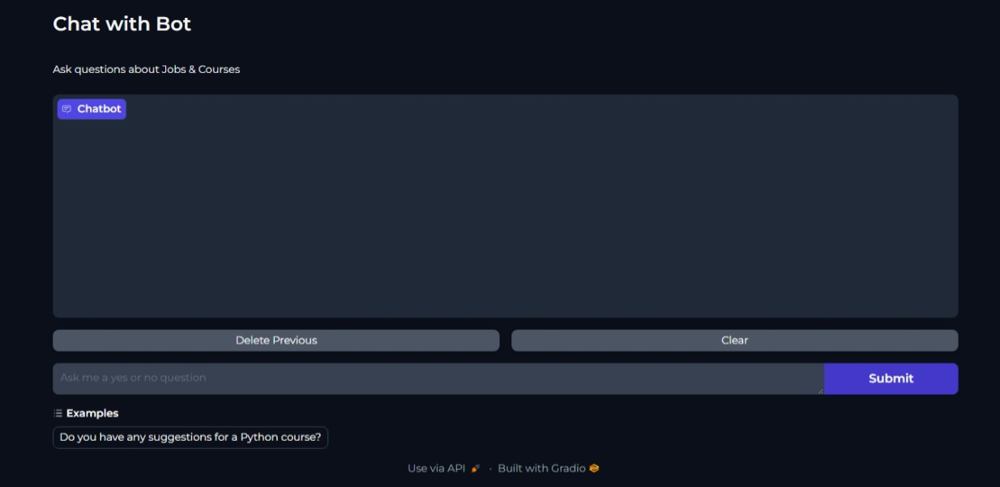

# Chatbot Application


This is repository contains source code for my final semester project.

## Installation

Open Anaconda prompt and create new environment

```
conda create -n your_env_name python = (any_version_number > 3.10)
```

Then Activate the newly created environment

```
conda activate your_env_name
```

Clone the repository using `git`

```
git clone https://github.com/Prakashdeveloper03/CareerBot.git
```

Change to the cloned directory

```
cd <directory_name>
```

To install all requirement packages for the app

```
pip install -r requirements.txt
```

Then, Run the app

```
python app.py
```

## 📷 Screenshots

### Chatbot


